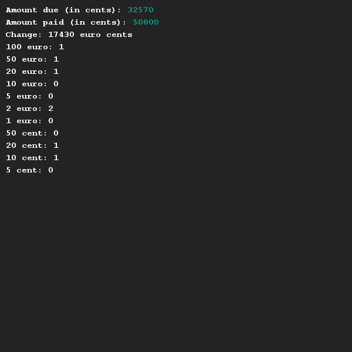

# Wisselgeld berekenen
## Moeilijkheid:    

Schrijf een programma dat uitrekent wat voor wisselgeld (in munten / biljetten) je zou moeten terugkrijgen in een winkel bij een of andere aankoop. Uiteraard vraag je eerst om het bedrag wat je moet betalen en vervolgens het bedrag dat betaald is. De winkel heeft geen biljetten groter dan 100 euro en geen munten van één en twee eurocent. Om afrondingen te voorkomen werken we in de gehele opdracht met centen.

## Voorbeeld

## Relevante links
* [Java documentatie van de SaxionApp](https://saxionapp.hboictlab.nl/nl/saxion/app/SaxionApp.html)