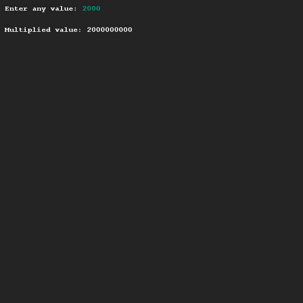

# Reaching limits
## Difficulty:    

Variables cannot store infinite values. In this exercise you'll explore the limit of the integer data type.

Create a program that prompts you for an integer. After entry, the value of the integer is multiplied by 1,000,000 (one million) and printed out again. Once you have created this program, experiment with the following values:
* 2000
* 2100
* 3000

Discover what the maximum value of an integer typed variable is and confirm this by Googling it.

## Example

## Relevant links
* [Java documentation of the SaxionApp](https://saxionapp.hboictlab.nl/nl/saxion/app/SaxionApp.html)

