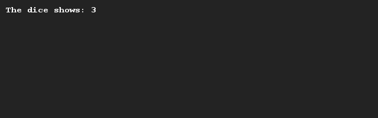

# Throwing a die (basic)
## Difficulty:    

Create a program that simulates a die toss. You can use the SaxionApp system to generate a random value for you.

## Example

## Relevant links
* [Java documentation of the SaxionApp](https://saxionapp.hboictlab.nl/nl/saxion/app/SaxionApp.html)