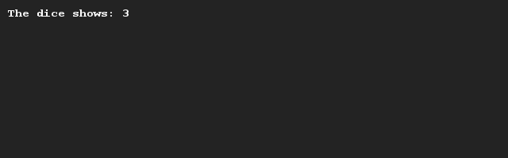

# Een dobbelsteen gooien (eenvoudig)
## Moeilijkheid:    

Schrijf een programma waarmee je een dobbelsteen worp kan simuleren. Het SaxionApp systeem kan je helpen met het genereren van een willekeurige waarde.

## Voorbeeld

## Relevante links
* [Java documentatie van de SaxionApp](https://saxionapp.hboictlab.nl/nl/saxion/app/SaxionApp.html)