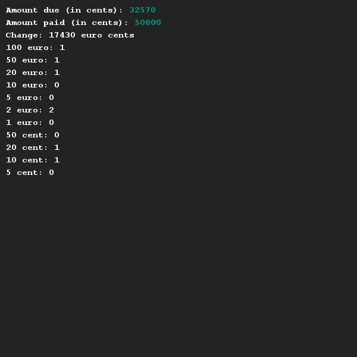

# Calculating change
## Difficulty:    

Write a program that calculates the amount of change (and corresponding coins/bills) given a certain purchase. First you should prompt for the amount due and amount paid. There are no bills / coins larger than 100 euro present in the store. To prevent rounding errors, we'll only use cents (integers) in this application.

## Example

## Relevant links
* [Java documentation of the SaxionApp](https://saxionapp.hboictlab.nl/nl/saxion/app/SaxionApp.html)