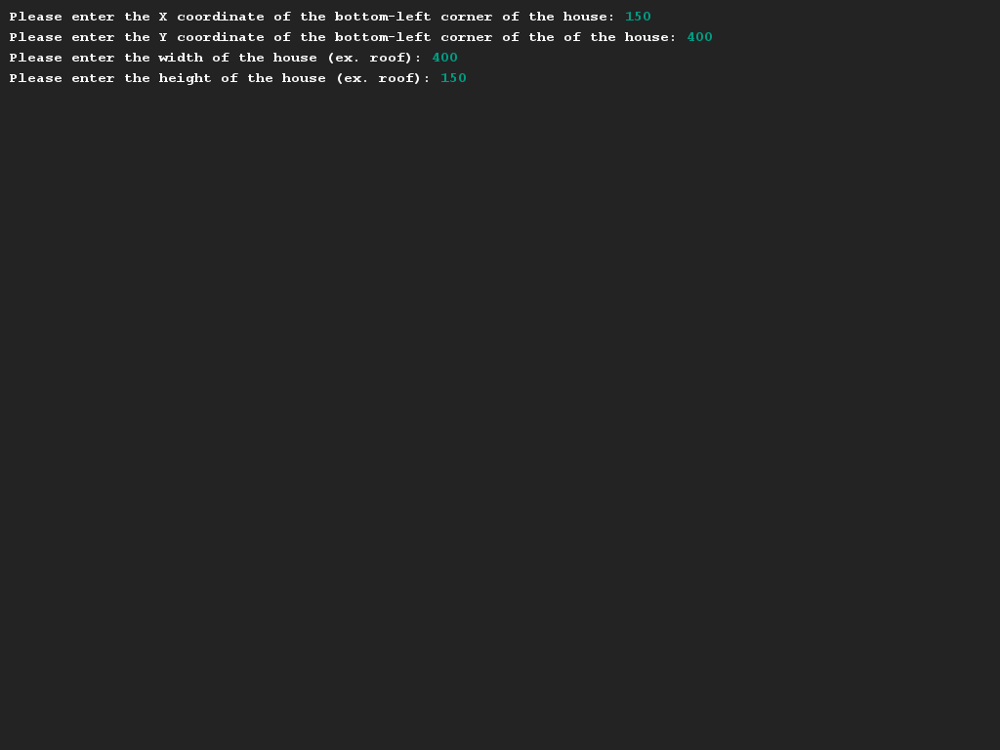
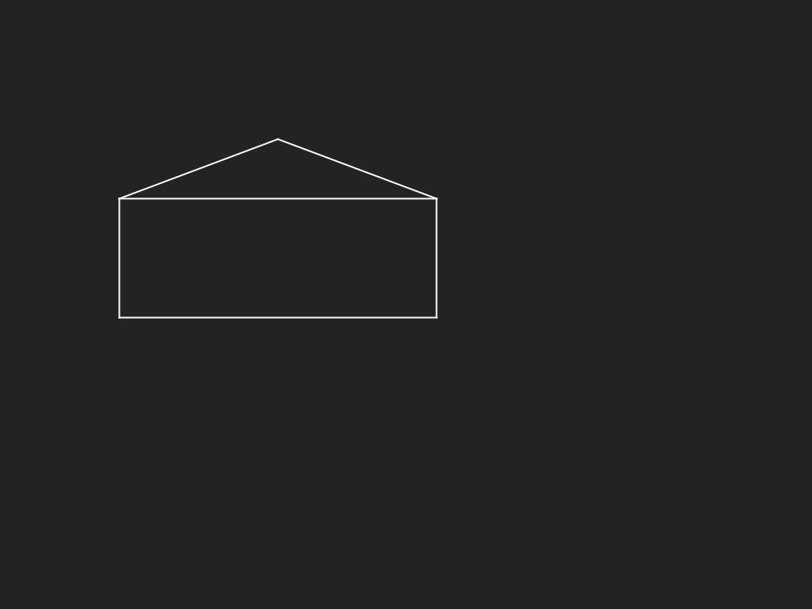

# A scalable home
## Difficulty:    

Write a program that can draw a scalable house. You'll need to provide the coordinates of the bottom-left corner so you know where to start drawing. You should also be able to specify a width and height of the home, that will be used to strech the base (the rectangle) of the house.

The roof will always be constructed in the same way: the middle of the roof will be in the center of the house (width / 2) and the height of the roof will always be at (height / 2).

_Hint:_ Try drawing this thing on paper or something where you can enable a grid.
 
## Example

## Relevant links
* [Java documentation of the SaxionApp](https://saxionapp.hboictlab.nl/nl/saxion/app/SaxionApp.html)