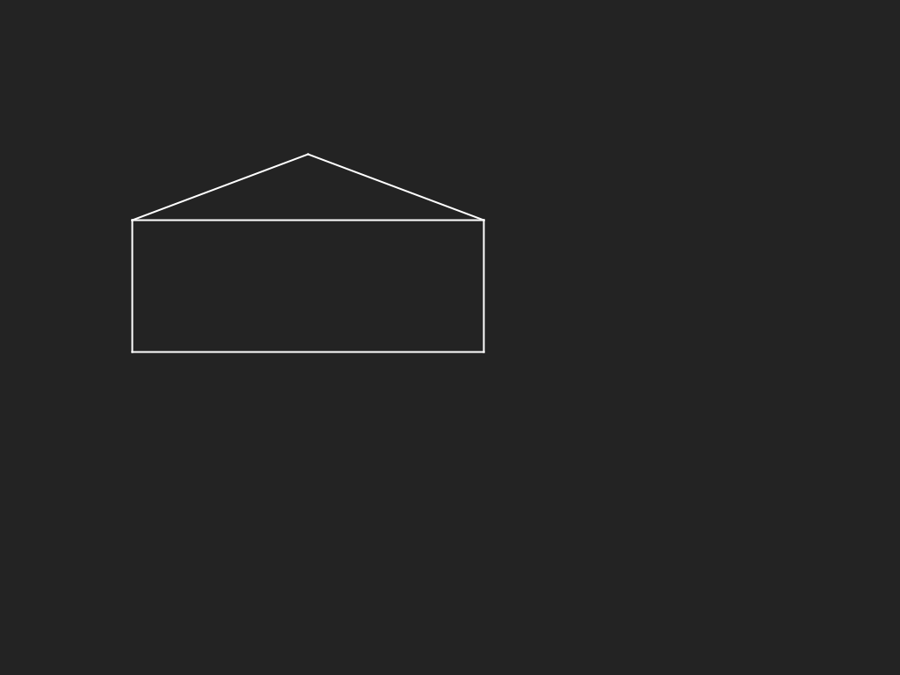

# Een schaalbaar huis
## Moeilijkheid:    

Schrijf een programma waarin je een schaalbaar huis laat tekenen. Je moet de coordinaten van de linkeronderhoek ingeven (als referentiepunt), gevolgd door de breedte en hoogte van het huis. De breedte en hoogte slaan uitsluitend op de rechthoekige basis van het huis (dus niet het dak). 

Het dak wordt vervolgens altijd op dezelfde manier geconstrueerd. Het midden van het dak (de punt) ligt altijd op de helft van de breedte (width / 2) en de hoogte van het totale dak is altijd de helft van de hoogte van het huis (height / 2).

_Tip:_ Teken eerst een eens huis op een stuk (geruit) papier. Dat maakt het rekenwerk een stuk eenvoudiger! 

## Voorbeeld

## Relevante links
* [Java documentatie van de SaxionApp](https://saxionapp.hboictlab.nl/nl/saxion/app/SaxionApp.html)
