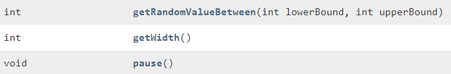
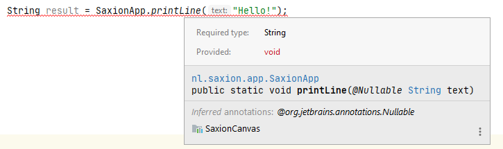

#Exercises Methods 2
Competence: _I can invoke methods that have return values_.

The exercises can be found in the different submodules. 

## Summary
Besides a direct function (like printing to a screen), a method can also be used to return a specific value, such as a complex calculation or some other partial result. In theory, a method can return any data type as long as they are known inside the program that you are writing (this will become more clear in the next few weeks). A method can only return 1 value at any given invocation.


What exactly is returned by a method you have to look up in the `javadoc` of this method or look at the code of the method. Usually you can also make a prediction based on the method name. (But if you run into crazy mistakes, it is worth checking the documentation first!).

A method does not always have to return a value. In this case we call it that type of return value is _void_.

When looking at the `javadoc` you can expect something like this:

 

The methods `getRandomValueBetween` and `getWidth` both return a value of type int. The method `pause` returns nothing and this is indicated by the word `void`. When a method is supposed to return a certain type or nothing at all can be decided by the creator of the method. With more experience you will learn how to define methods and make logical choices with regards to return types, but for now we will continue to use methods only.

You almost always want to save a return value in a variable (unless you know that you really won't do anything with it). You can easily combine this with the creation of a variable.

```java
int width = SaxionApp.getWidth(); // Declare a variable called with and initialize with the return value of getWidth()
``` 

If you try to store a value of a method that does not return anything (`void`) you will get an error message. 



The same goes for using the wrong type. If a method returns a _double_ value, you cannot just store it in an _integer_ variable. You will have to do something with this value before you can store it (e.g. cast the value).

Finally it is possible to use return values right away without storing them, although this is usually done at the cost of code readability. Whether you can or should do this depends entirely on the situation in which you want to use the code.
```
SaxionApp.printLine(SaxionApp.readString());                            //Ask the user for a string and directly print it on screen, without storing it
```

### SaxionApp methods, dealing with user input
The SaxionApp is able to capture invalid entries. This means that methods like `readString` and `readInt` 

```
String name = SaxionApp.readString();                   //Ask the user for a String and store the result
int value = SaxionApp.readInt();                        //Ask the user for a whole number and store the result
```
do not allow invalid values to be entered. If you enter a word in the `readInt` method you will see that the system gives an error message but will not crash. It is good to realize that this is not standard behavior of Java (normally your program would crash), but we have introduced it in order to make it easier to learn how to program.

