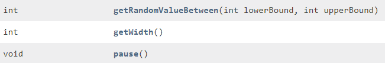
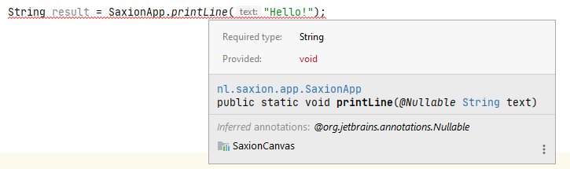

#Opdrachten Methoden 1
Competentie: _Ik kan methoden met terugkeerwaarden gebruiken_.

De opdrachten kunnen gevonden worden in de losse modulen. 

## Samenvatting
Een methode kan naast een praktische uitwerking in een programma (bijv. iets laten zien op het scherm) ook gebruikt worden voor een deelresultaat zoals bijv. een berekening.

Als we kijken naar wat een methode kan opleveren (_terugkeerwaarde_) dan zien we dat een methode in principe alle typen die bekend zijn in het programma kan teruggeven. Echter kan er altijd maar 1 waarde tegelijkertijd worden teruggegeven.

Wat er precies wordt teruggegeven door een methode moet je opzoeken in de `javadoc` van deze methode of naar de code van de methode te kijken. Meestal kan je op basis van de methodenaam echter ook wel een voorspelling doen. (Maar mocht je nu tegen gekke fouten aanlopen, loont het om dit even te controleren.)

Een methode hoeft niet altijd een waarde op te leveren. In dit geval noemen we dit dat type van de terugkeerwaarde _void_ is (void betekent _leegte_ in het Engels).

Een klein voorbeeldje:

 

De methoden `getRandomValueBetween` en `getWidth` leveren beiden een waarde van het type int op. De methode `pause` levert niets op en dit wordt aangeduid met het woordje `void`. Wanneer een methode precies iets moet gaan opleveren of wanneer niet is iets wat je eigen keuze is. Met meer ervaring zal je hier logischere keuzes in gaan maken, maar voorlopig blijven we methoden alleen nog maar gebruiken.

Een terugkeerwaarde wil je vrijwel altijd opslaan in een variabele (behalve als je weet dat je er echt niets mee gaat doen). Dit kan je eenvoudig combineren met het aanmaken van een variabele.

```java
int width = SaxionApp.getWidth(); // Declare a variable called with and initialize with the return value of getWidth()
``` 

Als je probeert van een methode die niets teruggeeft (`void`) een waarde op te slaan zal je een foutmelding krijgen. 



Hetzelfde gaat op voor het gebruik van een verkeerd type. Als een methode een _double_ waarde teruggeeft, kan je deze niet zomaar in een _integer_ variabele opslaan. Je zal hier iets mee moeten doen voordat dit kan (bijv. door de waarde te casten).

Tenslotte is het mogelijk, al gaat dit snel ten koste van leesbaarheid van de code, om terugkeerwaardes gelijk te gebruiken zonder deze op te slaan. Of je dit moet willen hangt volledig af van de situatie waarin je de code wil gebruiken.
```
SaxionApp.printLine(SaxionApp.readString());                            //Ask the user for a string and directly print it on screen, without storing it
```

### SaxionApp methodes, omgaan met gebruikersinvoer
De SaxionApp is in staat om ongeldige invoer af te vangen. Zo zullen de methoden 

```
String name = SaxionApp.readString();                   //Ask the user for a String and store the result
int value = SaxionApp.readInt();                        //Ask the user for a whole number and store the result
```
niet toestaan dat er verkeerde typen worden ingevuld. Als je bij de `readInt` methode een woord invult zal je zien dat het systeem een foutmelding geeft, maar niet zal crashen. Het is goed om je te beseffen dat dit geen standaardgedrag is, maar wij hebben geintroduceerd om beter te kunnen leren programmeren.

