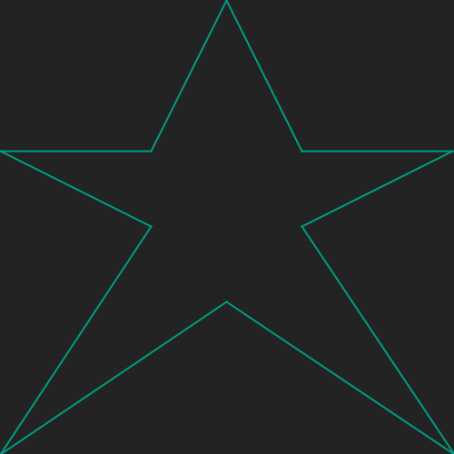

# Draw a star
## Difficulty:    

Create a program that allows you to draw a star by implementing the `drawStar()` method. Note that the star as described below consists of 10 individually drawn lines.

The location of the star on the screen is something you are allowed to hard code. So just an invocation of the `drawStar` method should be enough to display the star on the screen.

 

## Example

## Relevant links
* [Java documentation of the SaxionApp](https://saxionapp.hboictlab.nl/nl/saxion/app/SaxionApp.html)
