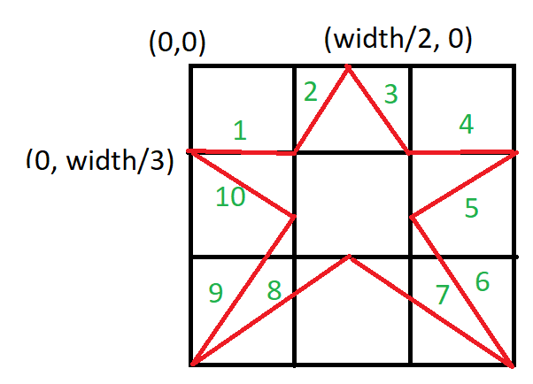
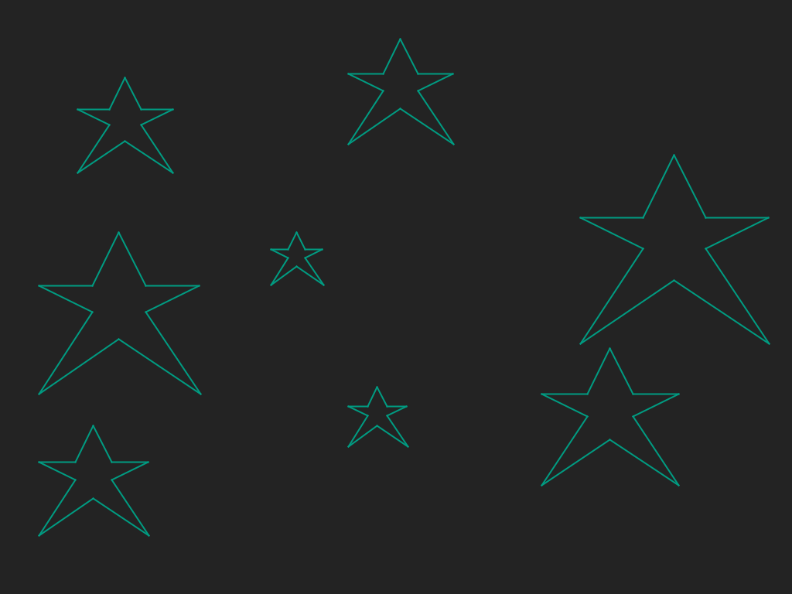

# Drawing multiple stars
## Difficulty:    

Create a `drawStar(int x, int y, int size)` method that allows you to draw a star on a certain given location _with a certain size_. The location is entered as a x,y coordinate which refers to the top-left corner of the star (see image below). Make sure that the star **does not** fill the entire screen, as we want to place multiple stars in the screen.

Fill out the screen with random stars as shown in the example by invoking your newly created method several times. Also change the size of each star by using the `getRandomValue`method from SaxionApp.

 

## Example

## Relevant links
* [Java documentation of the SaxionApp](https://saxionapp.hboictlab.nl/nl/saxion/app/SaxionApp.html)
