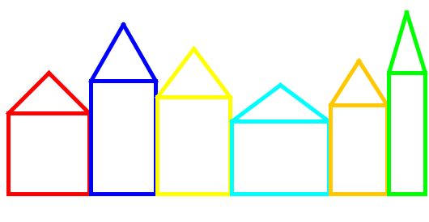

# Grachtenpanden
## Moeilijkheid:    

Implementeer de `drawHouse(int x, int y, int width, int height, Color color)` methode die een grachtenpand (uit Amsterdam) tekent met een gegeven x,y coordinaat en een zekere breedte, hoogte en kleur. 

De hoogte van het dak kan berekend worden door de helft van de lengte te gebruiken.

## Voorbeeld

## Relevante links
* [Java documentatie van de SaxionApp](https://saxionapp.hboictlab.nl/nl/saxion/app/SaxionApp.html)

