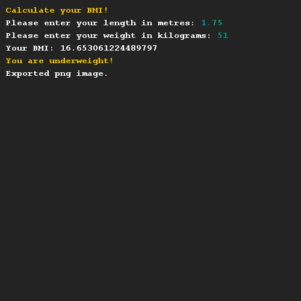
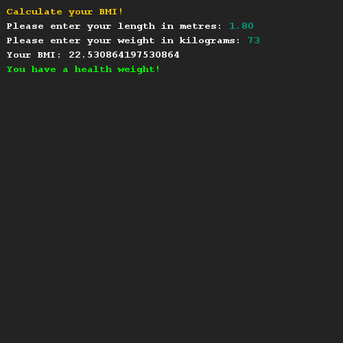

# Calculating your BMI
## Difficulty:     

Create a method that calculates your BMI (body mass index) based on your height and weight. Have a look at the documentation for the formula.

Provide feedback based on the different categories.

## Example

## Relevant links
* [BMI Wikipedia entry](https://en.wikipedia.org/wiki/Body_mass_index)
* [Java documentation of the SaxionApp](https://saxionapp.hboictlab.nl/nl/saxion/app/SaxionApp.html)
