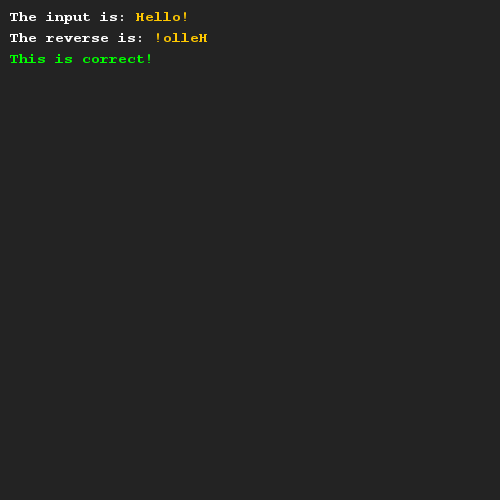
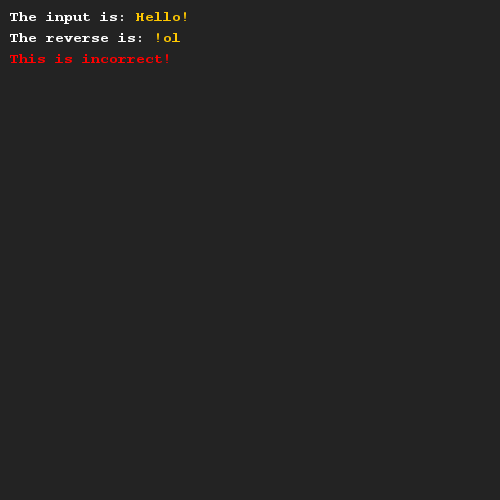

# Een String omdraaien
## Moeilijkheid:    

Schrijf een methode reverseString die je in staat stelt om de inhoud van een String inhoudelijk om te draaien. Gebruik hiervoor hulpmethoden uit de String klasse (zie documentatie, kijk vooral bij charAt).

Om je te helpen hebben wij een stukje code gegeven, waarmee je kan testen of je methode goed werkt.

## Voorbeeld

## Relevante links
* [Java documentatie van de SaxionApp](https://saxionapp.hboictlab.nl/nl/saxion/app/SaxionApp.html)
* [Java documentatie van de String klasse](https://docs.oracle.com/en/java/javase/11/docs/api/java.base/java/lang/String.html)

