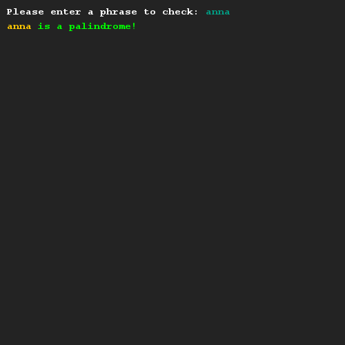
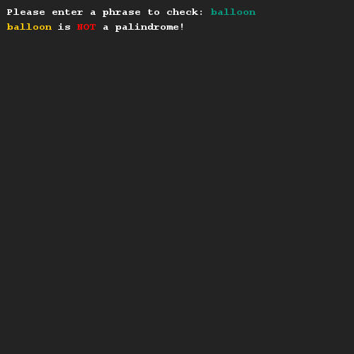

# Palindrome check
## Difficulty:     

Create a method `isPalindrome(String input)` that checks whether or not a String is a palindrome. Check the wikipedia entry for palindrome to find out what it is.

(Hint, you can use the reverse String method to help you out!)

## Example

## Relevant links
* [Java documentation of the SaxionApp](https://saxionapp.hboictlab.nl/nl/saxion/app/SaxionApp.html)
* [Java documentation for the String class](https://docs.oracle.com/en/java/javase/11/docs/api/java.base/java/lang/String.html)
* [Wikipedia entry for Palindrome](https://en.wikipedia.org/wiki/Palindrome)
