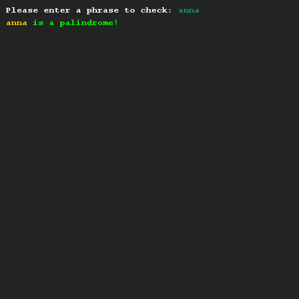
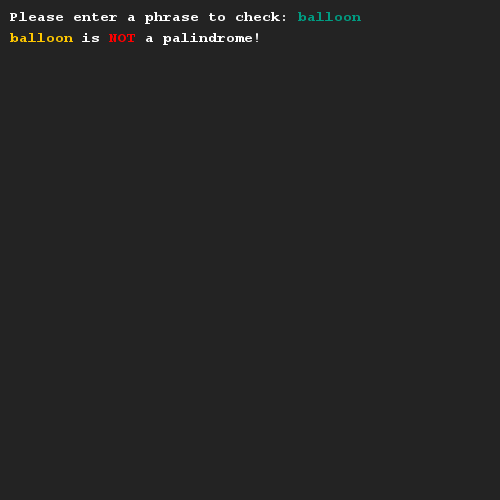

# Palindromen
## Moeilijkheid:    

Schrijf een methode `isPalindrome(String input)` die controleert of de gegeven invoer een palindroom is. Check de wikipedia link om te weten wat een palindroom is, mocht je dit niet weten.

## Voorbeeld

## Relevante links
* [Java documentatie van de SaxionApp](https://saxionapp.hboictlab.nl/nl/saxion/app/SaxionApp.html)
* [Java documentatie van de String klasse](https://docs.oracle.com/en/java/javase/11/docs/api/java.base/java/lang/String.html)
* [Wikipedia entry for Palindrome](https://nl.wikipedia.org/wiki/Palindroom)

