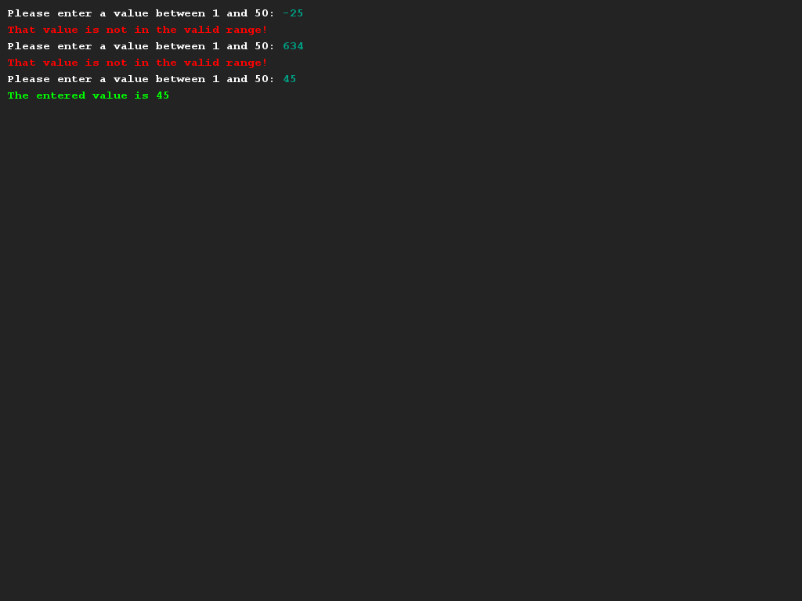

# Create a helper method
## Difficulty:     

One of the benefits of using methods is that we can now create so-called "helper"-methods. A helper method is a method that basically wraps around some existing method, but provides some additional functionality.

In this exercise, we'll create a helper method for the already existing method `readInt` that will allow us to read out an integer from the user between certain bounds.

Create the method `readIntBetweenBounds(int lowerBound, int upperBound)` and make sure it returns a certain value between the provided upper and lower bounds. (You should use a while-loop to do so!)

## Example

## Relevant links
* [Java documentation of the SaxionApp](https://saxionapp.hboictlab.nl/nl/saxion/app/SaxionApp.html)
