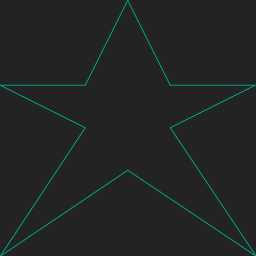

# Het tekenen van een ster
## Moeilijkheid:    

Schrijf een programma waarin je een methode schrijft die een ster kan tekenen genaamd `drawStar`. Deze methode vereist geen argumenten en tekent een ster volgens onderstaande specificaties (let op, het zijn 10 losse lijnen).

De plek waar de ster op het scherm moet komen is vrij te kiezen. Het gaat echter in de opdracht om het feit dat een aanroep van de `drawStar` methode er voor zorgt dat je een ster getekend ziet worden.

 

## Voorbeeld

## Relevante links
* [Java documentatie van de SaxionApp](https://saxionapp.hboictlab.nl/nl/saxion/app/SaxionApp.html)

