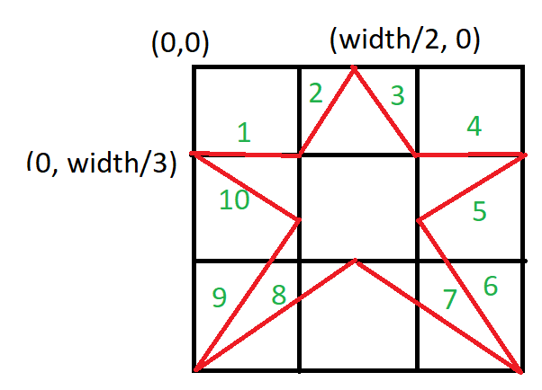
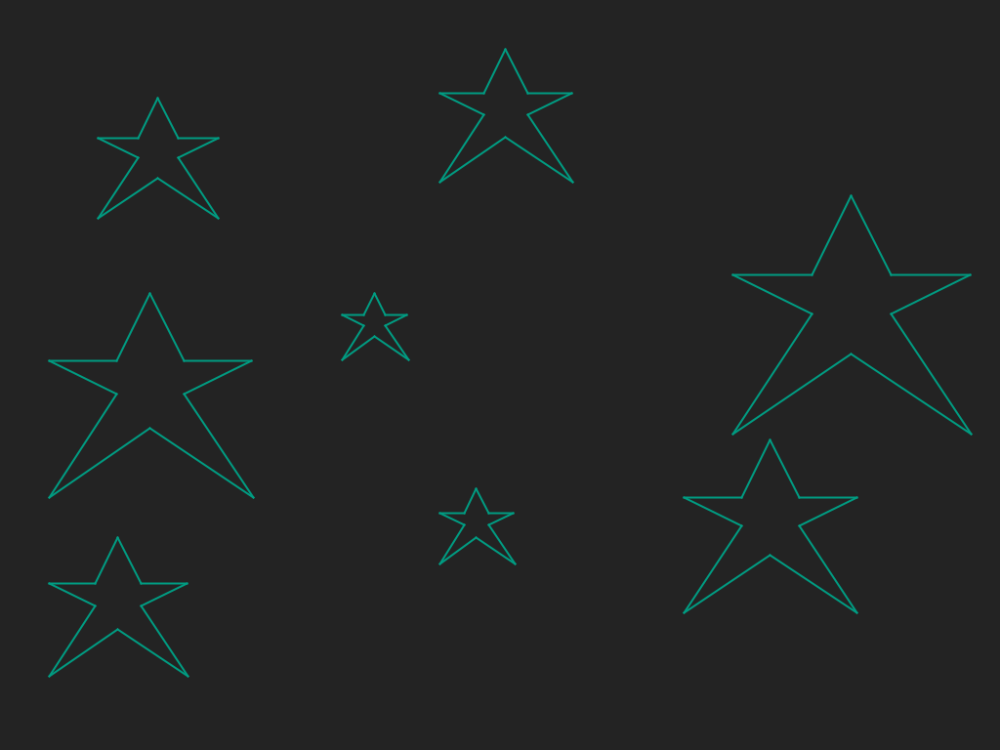

# Sterren tekenen
## Moeilijkheid:    

Schrijf een `drawStar(int x, int y, int size)` methode die je een ster laat tekenen op een bepaalde positie _met een gegeven formaat_. De x,y coordinaten die je meegeeft stellen de linkerbovenhoek van de ster voor (zie afbeelding) en het formaat moet gebruikt worden om de overige coordinaten te berekenen. Zorg er voor dat de ster **niet** het gehele scherm meer vult aangezien we meerdere sterren in hetzelfde scherm willen tekenen.

Vul het scherm met willekeurige sterren door meerdere keren gebruik te maken van de methode.

 

## Voorbeeld

## Relevante links
* [Java documentatie van de SaxionApp](https://saxionapp.hboictlab.nl/nl/saxion/app/SaxionApp.html)

