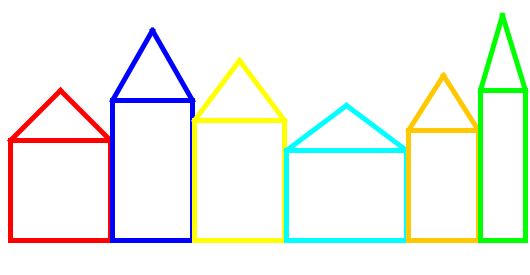

# Canal houses (Grachtenpanden)
## Difficulty:     

Implement the `drawHouse(int x, int y, int width, int height, Color color)` method that creates a house with provided x,y coordinates, width, height and color. Use this method to create a (simplistic version) of a street in Amsterdam filled with canal houses.

The height of the roof is 50% of the overall building height.

## Example

## Relevant links
* [Java documentation of the SaxionApp](https://saxionapp.hboictlab.nl/nl/saxion/app/SaxionApp.html)
