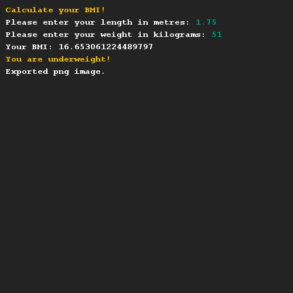
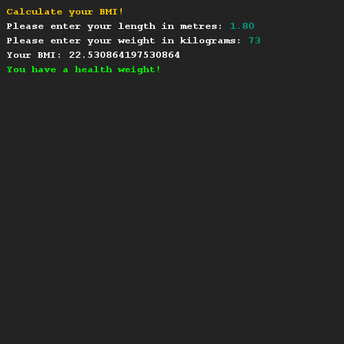

# BMI berekenen
## Moeilijkheid:    

Schrijf een methode waarmee je je BMI kan berekenen. Gebruik de onderstaande wikipedia link voor de formule en de verschillende categorieën.

Vergeet niet om de juiste categorie weer te geven na het berekenen van de BMI.

## Voorbeeld

## Relevante links
* [BMI Wikipedia pagina](https://nl.wikipedia.org/wiki/Queteletindex)
* [Java documentatie van de SaxionApp](https://saxionapp.hboictlab.nl/nl/saxion/app/SaxionApp.html)

