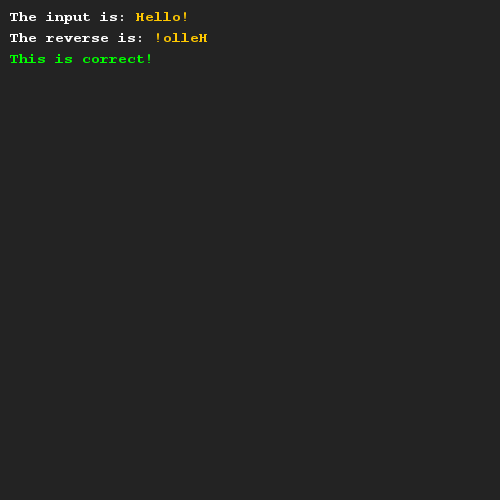
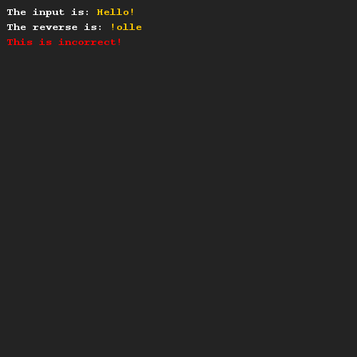

# Reversing a string
## Difficulty:     

Create a reverseString method that allows you to reverse the characters inside a String. You should use the helper methods of the String class (especially look at the charAt method).

To help you out, we have included some code that helps you test your solution.

## Example

## Relevant links
* [Java documentation of the SaxionApp](https://saxionapp.hboictlab.nl/nl/saxion/app/SaxionApp.html)
* [Java documentation for the String class](https://docs.oracle.com/en/java/javase/11/docs/api/java.base/java/lang/String.html)
