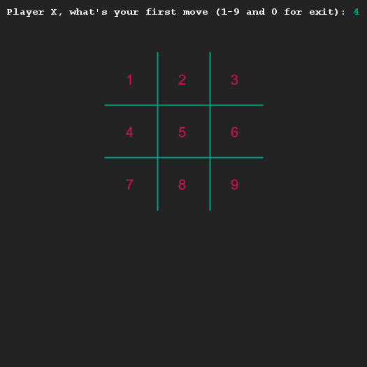
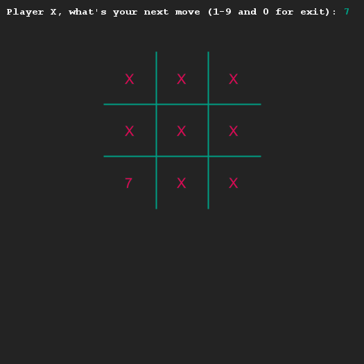

# Vereenvoudig Boter-kaas-en-eieren met methodes
## Moeilijkheid:   

Het is tijd dat we weer verder gaan met Boter-kaas-en-eieren.
De laatste stap had je gezet in exercise 9 van de submodule Loops1.
Het programma kan X-en plaatsen in het veld dat de gebruiker aangeeft.
En het veld is variabel in grootte, alles past zich aan aan de omvang die de gebruiker heeft aangegeven.

We gaan in deze opdracht geen functionaliteit toevoegen, we gaan alleen de code beter leesbaar maken door een groot stuk code te verplaatsen naar een apart methode.

__Opdracht 1:__
Schrijf een methode ```drawBoard``` die het bord tekent en de velden invult met de laatste stand.
Deze methode roep je aan iedere keer dat het bord wordt getekend.

Controleer goed of het programma nog steeds precies hetzelfde doet.

__Opdracht 2:__
Verplaats de code waarin de gebruiker wordt gevraagd om de omvang van het speelbord aan te geven naar een aparte methode.
Roep de methode vanuit het hoofdprogramma (de run-methode) op de correcte manier aan.

Controleer goed of het programma nog steeds precies hetzelfde doet.

## Voorbeeld




## Relevante links
* [Java documentatie van de SaxionApp](https://saxionapp.hboictlab.nl/nl/saxion/app/SaxionApp.html)