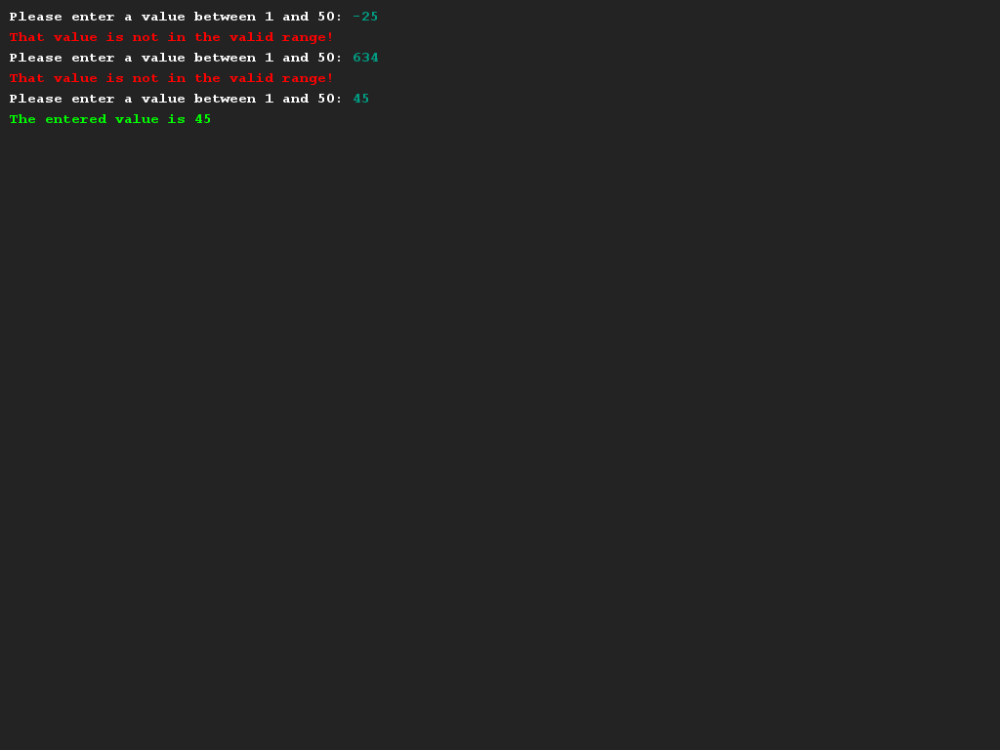

# Een hulp methode schrijven
## Moeilijkheid:    

Een toepassing van het nu kunnen schrijven van methoden is dat we ook zogenaamde "hulp-methoden" kunnen schrijven. Een hulpmethode is een methode die eigenlijk een andere methode omvat (of "wrapped") waarmee je wat extra gedrag kan toevoegen aan een bestaand iets.

In deze opdracht gaan we een hulpmethode schrijven om de bestaande SaxionApp methode `readInt` om te zorgen dat deze alleen een waarde binnen een bepaalde grens kan uitlezen.

Schrijf de methode `readIntBetweenBounds(int lowerBound, int upperBound)` die een getal van de gebruiker uitleest tussen twee meegegeven grenswaarden. Je kan hier het beste een while-loop voor gebruiken. 

## Voorbeeld

## Relevante links
* [Java documentatie van de SaxionApp](https://saxionapp.hboictlab.nl/nl/saxion/app/SaxionApp.html)
* [Java documentatie van de String klasse](https://docs.oracle.com/en/java/javase/11/docs/api/java.base/java/lang/String.html)
* [Wikipedia entry for Palindrome](https://en.wikipedia.org/wiki/Palindrome)

