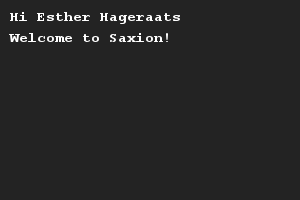

# Print iemands naam
## Moeilijkheid:    

Maak twee variabelen: één voor een voornaam en één voor een achternaam. Schrijf een programma dat deze persoon welkom heet bij Saxion.

## Voorbeeld

## Relevante links
* [Java documentatie van de SaxionApp](https://saxionapp.hboictlab.nl/nl/saxion/app/SaxionApp.html)