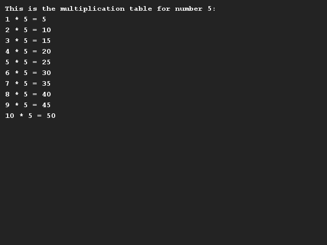

# Tafels van vermenigvuldiging
## Moeilijkheid:    

Schrijf een programma dat de tafel van vermenigvuldiging van een bepaald getal laat zien.

Maak een variabele waarin je opslaat van welke getal je de tafel je wilt tonen. Schrijf vervolgens de code waarmee deze tafel (t/m 10) wordt getoond.

_Tip_: In het voorbeeld hieronder zie je het sterretje (*) als _karakter (char)_. Voor het resultaat aan het eind van iedere regel heb je het sterretje ook nodig, maar dan als _operator_, een symbool dat daadwerkelijk iets doet met de variabelen. In deze opdracht zul je dus printbare zinnen moeten maken uit strings, variabelen en berekeningen.

## Voorbeeld

## Relevante links
* [Java documentatie van de SaxionApp](https://saxionapp.hboictlab.nl/nl/saxion/app/SaxionApp.html)

