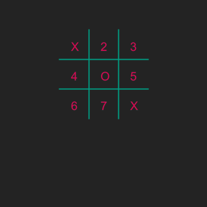

# TicTacToe
## Difficulty:    

TicTacToe / Crosses and Noughts isn't finished yet! Time to continue. In the previous series of exercises you have drawn the board as shown below.

Of course the idea is that two users input their move and that the board is refreshed every time a move is made. So we need variables to put the input of the user in.
Furthermore we would like to make the board a little bit more flexible so that later on you can allow the user to change the size of the board.

You can work with your own code of the previous assignment, but you can also work from the example code that we have given.

However, it is important that you make variables out of each field (because they can either contain an 'X', 'O' or can be left empty). 

_Tip_: Think about the data type for a moment. What type is most suited to contain just one character?

Note that we have numbered each field just to clarify the assignment.

## Example

## Relevant links
* [Java documentation of the SaxionApp](https://saxionapp.hboictlab.nl/nl/saxion/app/SaxionApp.html)