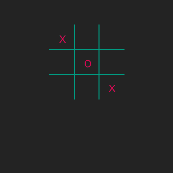

# Boter-kaas-en-eieren vervolg
## Moeilijkheid:   

Nadat we de eerste variabelen hebben toegevoegd aan ons Boter-Kaas-en-Eieren spel, willen we het hele board flexibel maken. Hiermee bedoelen we dat we het spelbord groter kunnen maken, op basis van een of andere variabele.

In deze opdracht introduceren we een `size` variabele en gaan hiermee aan de slag.

De opdracht:
1. Definieer de omvang van het window met behulp van de variabele ```size``` zodanig dat het resultaat hetzelfde is als we nu hebben en dat het programma nog steeds werkt.
2. Definieer nu de lijnen die je hebt getekend met behulp van deze zelfde variabele. En controleer het resultaat. 

Bekijk eens wat gebeurt als je ```size``` groter maakt, bijvoorbeeld 60. Je zult zien dat de X en O niet meebewegen. Dat gaan we in de volgende oefening oplossen.

## Voorbeeld


## Relevante links
* [Java documentatie van de SaxionApp](https://saxionapp.hboictlab.nl/nl/saxion/app/SaxionApp.html)