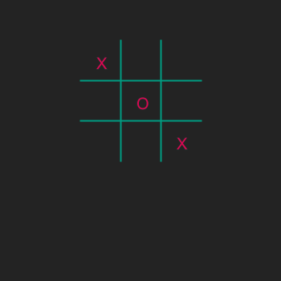
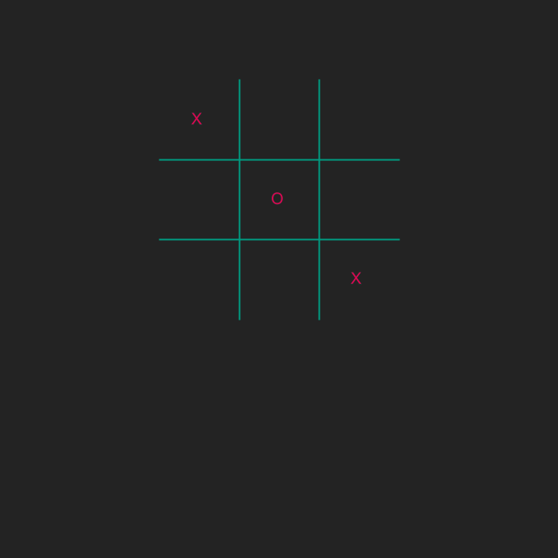

# Pixelart Mario 
## Difficulty:    

In the previous exercise you have made the gameboard of your game Noughts and Crosses flexible in size.
But that is not enough, because the position of the moves players make, the X and O, need to be flexible as well.

You will be solving that problem in this exercise.
To do that you will need something new: typecasting. We have made a video explaining what that is.

As with the other exercises, you can use your own code or work from the code that we presented as solution with the previous exercise.

The assignments are:
1. Look at the video about typecasting.
2. Before you start programming, calculate how to derive the position of an X or O, from the variable ```size```.
You will probably need typecasting if you want to position them neatly.
3. Change the code so that the position is flexible. 
4. Try is out with different values for ```size```.
5. If you are really in the mood, you can also make the fontsize flexible.

## Example



## Relevant links
* [Java documentation of the SaxionApp](https://saxionapp.hboictlab.nl/nl/saxion/app/SaxionApp.html)