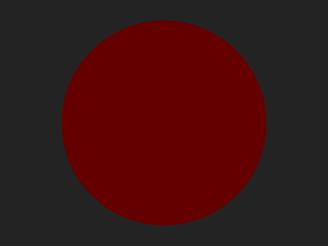
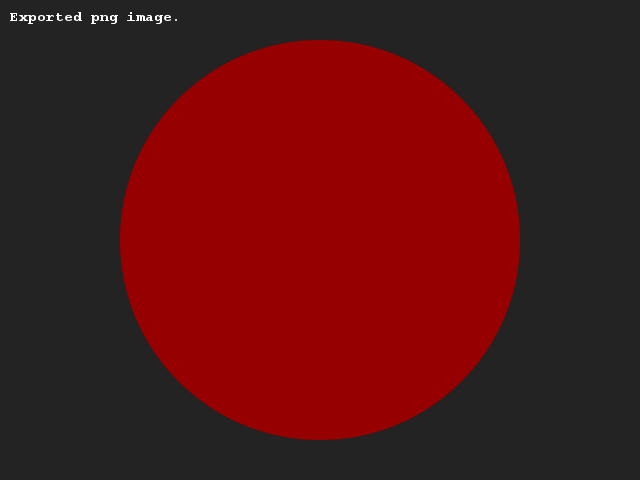
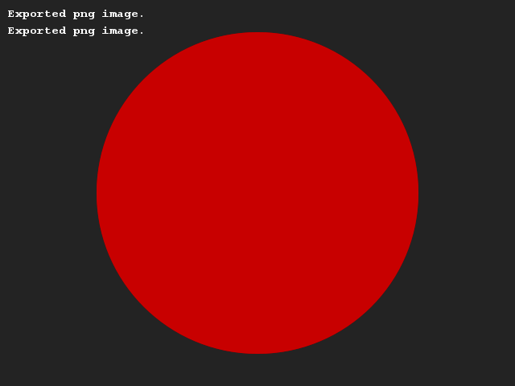
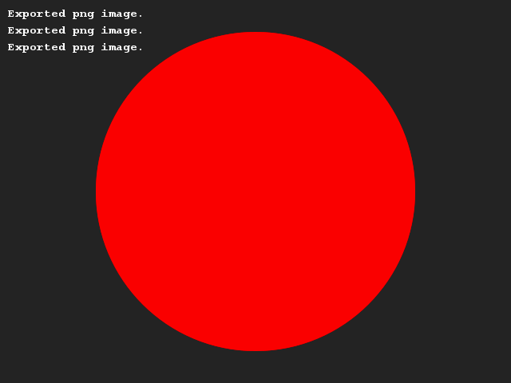

# Kleurverschuivingen
## Moeilijkheid:   

Naast de afmetingen van een afbeelding kan je ook de kleuren aanpassen op basis van variabelen. Schrijf een programma wat de "roodheid" van een kleur verhoogt. Begin met een roodheid van 100 en verhoog deze waarde 3x met 50 tot je uiteindelijk op 250 uitkomt.

Maak een grappige of leuke afbeelding waarin je deze kleur tot uiting laat komen. Omdat wij een beetje lui zijn hebben wij gekozen om een cirkel te tekenen (maar in principe kan dit dus alles zijn.)

## Voorbeeld

(Let op: Het "Exported png image" zinnetje komt vanwege het feit dat deze voorbeelden zijn gegenereerd met de oplossing. Dit hoef jij niet te zien.)

## Relevante links
* [Java documentatie van de SaxionApp](https://saxionapp.hboictlab.nl/nl/saxion/app/SaxionApp.html)

