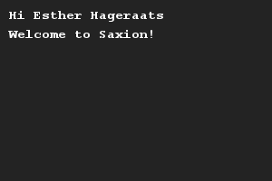

# Printing someones name
## Difficulty:    

Create two variables: one for someones first name and one for someones last name. Write a program that greets this person.

## Example

## Relevant links
* [Java documentation of the SaxionApp](https://saxionapp.hboictlab.nl/nl/saxion/app/SaxionApp.html)