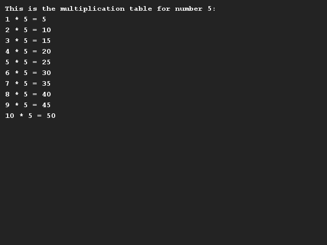

# Multiplication tables
## Difficulty:    

Write a program that calculates and shows the multiplication table of a certain number.

Create one variable in which you store the number you want to have multiplied. Then write a program that will print the first 10 steps of the multiplication table.

_Tip_: In the example output below you see the asteriks (*) as _character_. For the real calculation you also need the asteriks. Then the asteriks is an _operator_, actually doing something with the variables. So this assignment requires that you create a printable sentence from strings, variables and calculations.

## Example

## Relevant links
* [Java documentation of the SaxionApp](https://saxionapp.hboictlab.nl/nl/saxion/app/SaxionApp.html)

