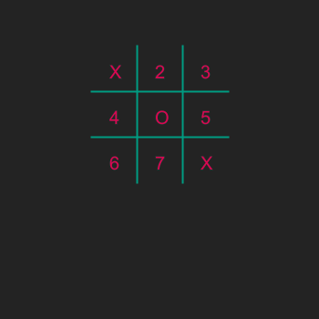

# Boter-kaas-en-eieren vervolg
## Moeilijkheid:   

We gaan moedig verder met Boter-Kaas-en-Eieren. In de vorige serie oefeningen heb je het board getekend dat hieronder staat weergegeven.

Natuurlijk is het plan dat straks twee gebruikers in kunnen geven wat hun volgende zet is en dat het bord ververst wordt na iedere zet.
Verder willen we dat het board een beetje flexibeler wordt zodat de gebruiker kan bepalen hoe groot het bord wordt.

Je kan werken met jouw eigen code van de vorige opdracht, maar je kunt ook beginnen met de uitwerking die wij hebben gemaakt.

Maak de letters die geprint worden (X en O) variabel. Het is dus belangrijk dat in de code er een duidelijk onderscheid tussen de velden te vinden zijn. 

_Tip_: Welk datatype is het meest geschikt om een enkel teken te bevatten? 

Voor de duidelijkheid hebben wij de velden genummerd.

## Voorbeeld

## Relevante links
* [Java documentatie van de SaxionApp](https://saxionapp.hboictlab.nl/nl/saxion/app/SaxionApp.html)