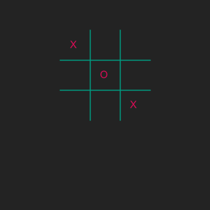

# TicTacToe continued
## Difficulty:    

In the previous exercise you have made variables that can be filled with an X or an O.

Let's introduce a `size` variable that we can use to calculate the new dimensions of our board. Initialize this variable with a size of `50` and make sure the board is drawn (similar to the previous exercise). 

Next..
1. Define the size of the window using this variable `size` so that the resulting window has the same size as it has now. And check if the program is still working. You can use the `resize(..)` method for this.
2. Now define the lines that where drawn using this same variable. And check the result.

Check what happens when you change `size` into something rather big (e.g. 100-200). If the program works OK, the window and the board will be bigger, but the nought and crosses didn't move with it. In the next exercise we will work with that.

## Example

## Relevant links
* [Java documentation of the SaxionApp](https://saxionapp.hboictlab.nl/nl/saxion/app/SaxionApp.html)