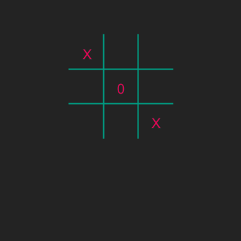

# Pixelart Mario
## Moeilijkheid:   


In de vorige oefening heb je het bord van je spel BOter-Kaas-en-Eieren flexibel gemaakt in grootte.
Maar dat is niet genoeg, want de positie van de zetten die de spelers maken, de X en O, moeten ook flexibel zijn.

Dat probleem ga je in deze oefening oplossen.
Om dat te doen heb je iets nieuws nodig: typcasting. We hebben een video gemaakt waarin we uitleggen wat dat is.

Net als bij de andere oefeningen kun je je eigen code gebruiken of werken vanuit de code die we bij de vorige oefening als oplossing hebben gepresenteerd.

De opdrachten zijn:
1. Kijk naar de video over typecasting.
2. Bereken, voordat je begint met programmeren, hoe je de positie van een X of O kunt afleiden uit de variabele ```size```.
Je zult waarschijnlijk typecasting nodig hebben als je ze netjes wilt positioneren.
3. Verander de code zodat de positie flexibel is. 
4. Probeer dit uit met verschillende waarden voor ```size```.
5. Als je echt in de stemming bent, kun je ook de lettergrootte (fontsize) flexibel maken.

## Voorbeeld



## Relevante links
* [Java documentatie van de SaxionApp](https://saxionapp.hboictlab.nl/nl/saxion/app/SaxionApp.html)