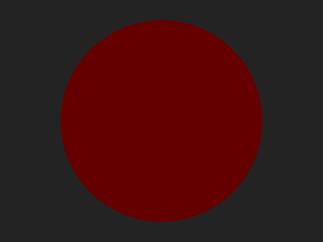
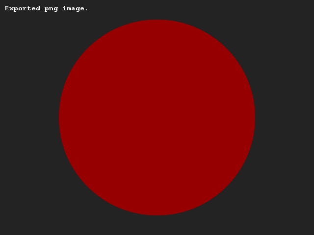
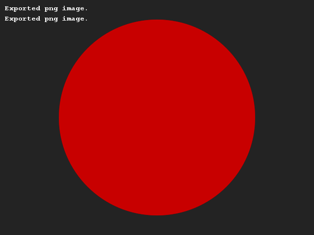
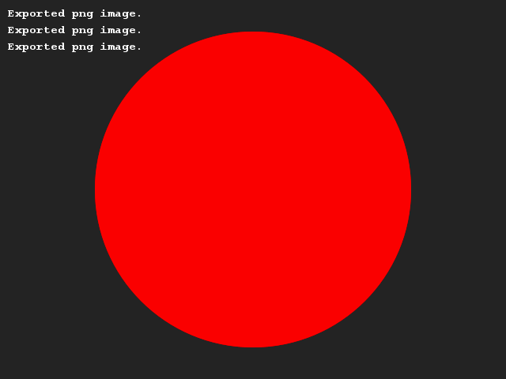

# Shifting colors
## Difficulty:    

Besides the dimensions we can also use variables to adjust the color. Create a program that increases the "redness" of a color in steps of 50 (starting at 100) and keep redrawing a figure to show this color.

Create an image that reflects this color change. Make it funny or creative (like a sunset). Just because we are lazy (and have given you a circle in the example), doesn't mean you have to be!
## Example

(Note the "export" statement is our tool saving these example images. You don't have to see this in your version.)

## Relevant links
* [Java documentation of the SaxionApp](https://saxionapp.hboictlab.nl/nl/saxion/app/SaxionApp.html)